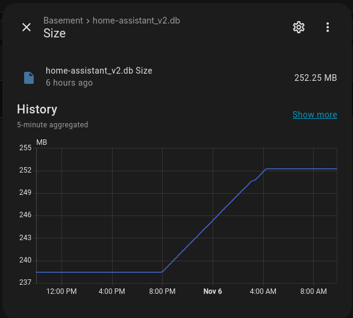

+++
date = '2025-11-06T09:49:41-05:00'
draft = true
title = 'Managing_haos_db'
+++

So I have been spending too much time with Home Assistant as of late. I find it much more polished since I first starting messing around with it a couple of years ago. I've managed to find all the levers I need to really start building some stuff out. Some of the things I've done so far are:
  * Move from using a Raspberry Pi 4 running Home Assistant OS (HAOS) to a dedicated Mini-PC running a HAOS VM managed by ProxMox
  * Visualize useful weather trends for multiple zones using the Statistics Graph Card and Apex Charts
  * Setup automatic backups to my Samba share
  * Use the ESPHome add-on to more easily setup a BME688 air quality sensor attached to a Raspberry Pi Pico W
  * and other things...

With the new sensors has come a sharp uptick in DB usage size. 

So I did a search and came across this page which I will review, https://community.home-assistant.io/t/how-to-keep-your-recorder-database-size-under-control/295795.

In general, I'd like to better understand the Home Assistant Database Model, so this is a very good angle into that.
